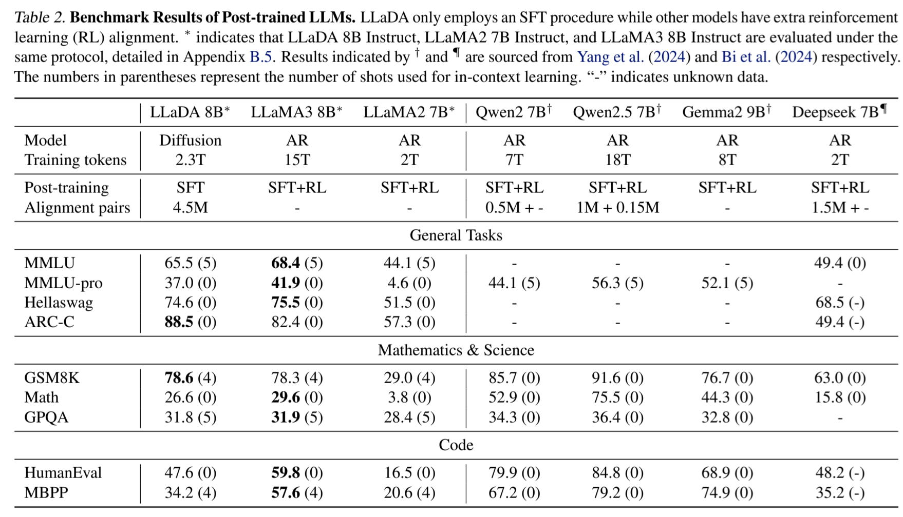
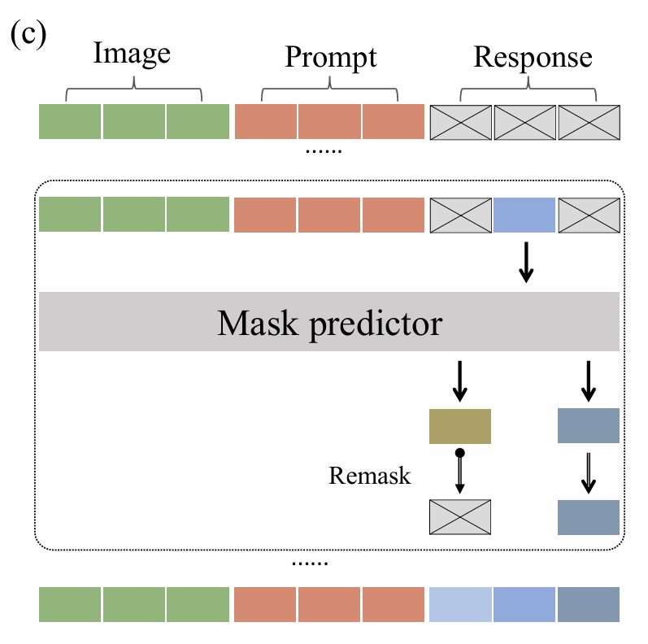
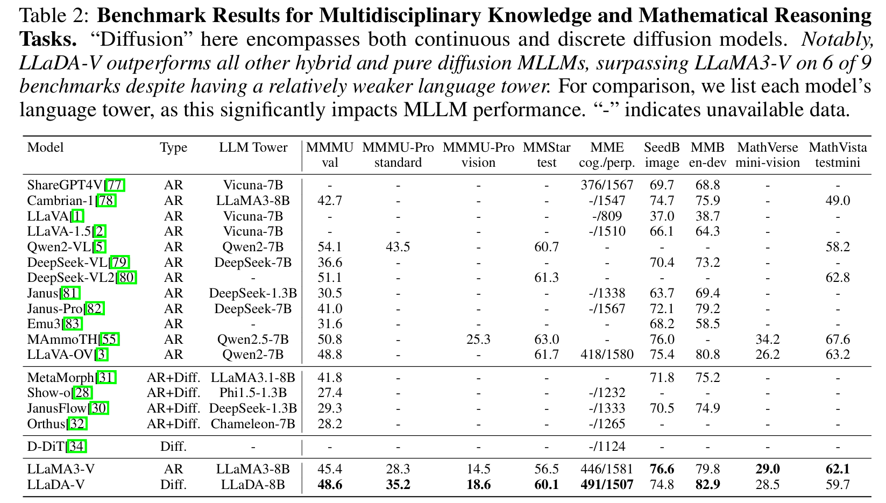

# 文献阅读

趁着早上状态比较好，多读几篇文章。前两天在小红书刷到了用扩散模型的思路来做 LLM，看起来挺有趣的。由于该反向对我来说是一个比较陌生的领域，所以我比较喜欢先读一些老文章再慢慢过渡到新文章，希望以 top-down 的方式摸索发展脉络。

## 1. Large Language Diffusion Models

找到的第一篇文章叫做 **Large Language Diffusion Models**，看标题应该是开山之作，今年（2025）二月份的文章。作者来自人大高瓴和蚂蚁团队，文章提出的模型名为 LLaDA 8，并声称与 LLaMA 3 8B 相当。还解决了逆转诅咒（可以倒背诗歌）。

作者在引言表示自回归可能并非生成式建模唯一的可行路径，意思是说目前 LLM 可以达到的效果，扩散模型也可以尝试。同时对于目前的自回归模型（autoregressive models, ARM），作者声称逐个 token 的计算方式会产生高昂计算成本并限制逆向推理的有效性。并表示他们的 LLaDA 采用一种掩码扩散模型（masked diffusion model, MDM），将有可能解决这个问题。后面的引言内容作者就在说自己用了很多算力很多数据，在六个任务上实现了与相同训练数据的自建 ARM 相当的结果。

### 方法

LLaDA 通过前向过程和反向过程定义了一个模型分布。在前向过程中逐渐给 token 加掩码，然后反向过程采用迭代预测被掩码的 token 来恢复数据分布。放到文本对话阶段里呈现的形式就是反向迭代预测被掩码的 response 的 token。

我认为需要注意的是，在训练阶段对每个样本 token 进行随机比例的掩码，仅在被掩位置上用交叉熵监督对齐一次性复原，然后更新参数。但在推理生成阶段，为了与前向随机掩码机制匹配，会进行多步迭代，每轮迭代都会把被掩码的位置尝试补上 token，然后只保留其中一部分被揭开的 token，剩下的按比例再次盖上掩码。并且比例从 100% 慢慢往下降，例如 100%、75%、50%、25%、0%。这样被遮住的掩码部分越来越少，最后得到完整答案。

### 重新掩码策略

同时作者介绍了两种重新掩码策略：
- **低置信度重新掩码**：优先把置信度最低的那部分盖回去。
- **半自回归重新掩码**：把序列自左到右切成若干 patch，在每个块内部仍用上面的并行去噪 + 重掩，兼顾了并行与自回归的优点。

### 实验结果

在实验部分，看得出来模型的一些点数是不如 LLaMA 3 8B 的，但整体还能看，并没有差距很大。

### 一些想法

关于扩散语言模型，我在读完后有一些思考。我是极力推崇 *less is more* 的，在架构策略的发展上，我认为应该给模型越来越少的约束。比如当初的 BERT，它是采用给前面和后面的 token 补全中间的部分。而后的 GPT 是只给前面的 token，顺序预测之后的 token，明显 GPT 的约束更少。

但是扩散语言模型相比 GPT 的架构有实现更少的约束吗？从解码过程上来看，它好像更加复杂了，推理过程多步迭代会受到很多参数的约束，例如掩码比例、迭代多少步和具体的重新掩码策略。但如果从解码顺序来看，扩散语言模型是进一步简约了，它不在强制要求模型的 token 按照顺序出现，每个 token 可以自由出现在未被填补的任何位置。

如果可以令模型自由迭代选择推理过程的各种参数，它会不会进一步提升效果？

## 3. LLaDA-V: Large Language Diffusion Models with Visual Instruction Tuning

第二篇文章名为 **LLaDA-V: Large Language Diffusion Models with Visual Instruction Tuning**，发表于今年五月份，作者依然是那几个人，只是名字顺序有所调整。这篇文章聚焦于多模态（视觉）扩散语言模型，由于有了第一篇文章的基础，所以这篇文章理解得很快。

### 训练过程

简单来说，训练分为三个阶段：
1. **第一阶段**：这篇文章先使用 SigLIP 2（谷歌发表于 2025 年 2 月的 SOTA 模型）提取视觉 token，再通过可训练的 MLP 与文本 token 进行对齐。
2. **第二阶段**：对扩散语言模型进行视觉指令的微调。
3. **第三阶段**：使用包含详细的推理链和最终答案的数据集增强模型的多模态推理能力。

这是一个比较标准的多模态推理训练流程，值得一提的是全程采用 SFT 进行微调，即使是第三阶段也没有涉及 RL 微调。

### 实验结果

从实验结果来看，LLaDA-V 比起 Qwen2 还是差了一些，但依然可以接受。

